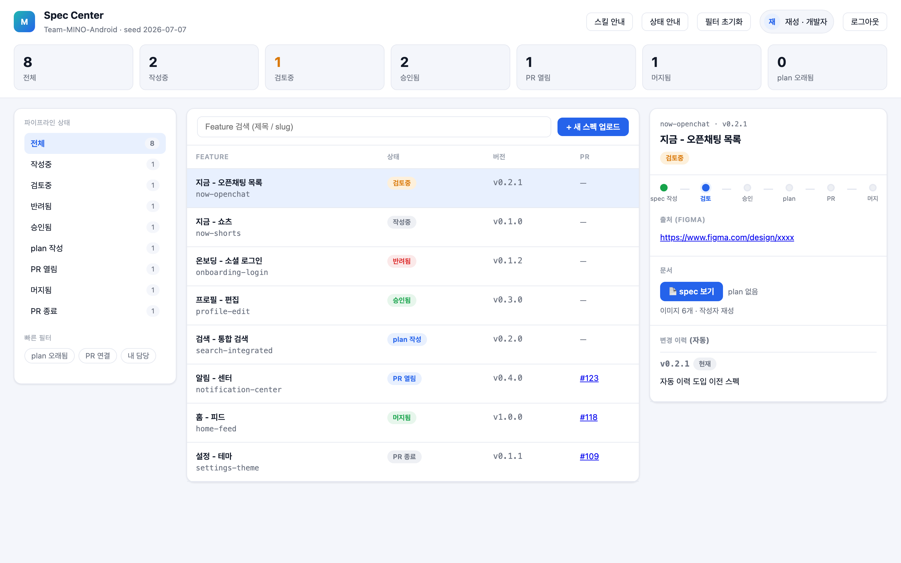
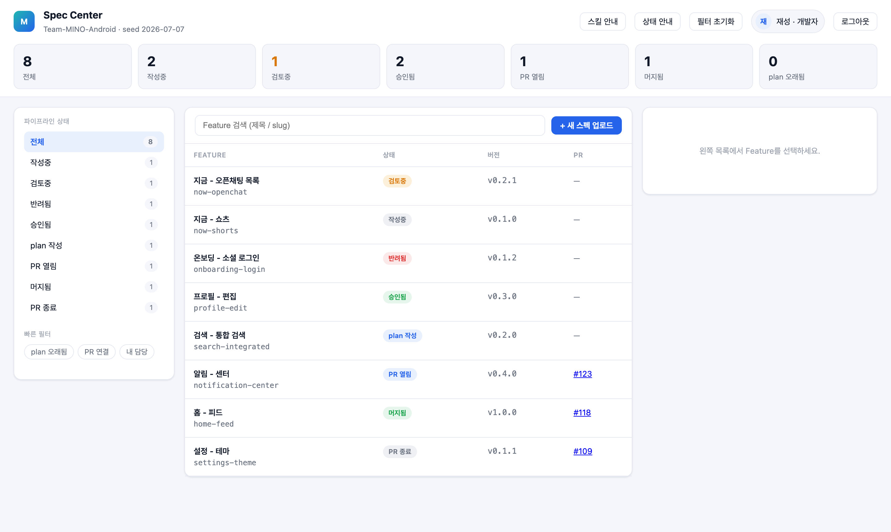
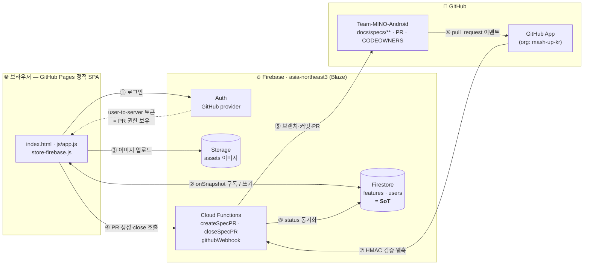

<div align="center">

# 🅼 MASC · Mino Android Spec Center

**디자이너 컨펌부터 문서 PR까지, 안드로이드 스펙 파이프라인을 한 화면에서.**

Team-MINO-Android의 기능 스펙(spec) · 구현 계획(plan)을 업로드하고,
디자이너 컨펌 게이트를 거쳐 `docs/specs/**` 문서 PR로 자동 배출하는 대시보드입니다.

[](https://mash-up-kr.github.io/mino-android-spec-center/)
[](#-인프라-아키텍처)
[](LICENSE)



</div>

---

## MASC란?

기획·디자인은 Figma에, 스펙 문서는 여기저기 흩어지고, "이 화면 확정된 거 맞아요?"를 매번 물어보던 흐름을 하나의 파이프라인으로 묶습니다.

- **개발자**가 로컬 스킬(`spec-gen`)로 만든 spec.md와 이미지를 업로드하면,
- 대시보드가 **구조를 기계 검증(S1–S6)**하고,
- **디자이너가 화면 단위로 컨펌**(승인/반려+코멘트)하고,
- 승인된 스펙은 plan과 함께 **`docs/specs/{slug}/` 문서 PR로 자동 생성**되며,
- PR이 머지/종료되면 **웹훅으로 상태가 되돌아옵니다.**

하나의 기능(`docs/specs/{feature}/`)은 **8개 상태를 가진 단일 파이프라인**으로 흐르고, Firestore가 유일한 진실(SoT)입니다.

```
spec_draft → spec_in_review → spec_approved → plan_drafted → pr_open → merged
                   ↓ 반려                                          ↘ pr_closed
        spec_changes_requested
```

> 승인 후 spec을 수정하면 자동으로 **무효화**됩니다 — `spec_draft`로 복귀하고, 열린 PR은 자동 close, 버전이 bump됩니다.

---

## ✨ 주요 기능

| | 기능 | 설명 |
|---|---|---|
| 📤 | **스펙 업로드 + 구조 검증** | drag-drop으로 spec.md·이미지 업로드. 필수 H2 8개·통제 어휘·이미지 정합 등 **S1–S6 기계 검증** 통과 시에만 생성 ([validation.md](docs/design/validation.md)) |
| ✅ | **디자이너 컨펌 게이트** | 화면/섹션 단위 **인라인 코멘트**로 승인·반려. 검토 중에는 spec read-only 잠금 |
| 🔀 | **문서 PR 자동 생성** | 승인+plan 완료 시 `docs/spec-{slug}-{version}` 브랜치·커밋·PR을 Cloud Functions가 생성. assignee·라벨·이미지 커밋 자동 |
| 🔁 | **웹훅 상태 동기화** | PR merged/closed 이벤트를 HMAC 검증 후 수신 → Firestore 상태 자동 갱신 |
| 🧬 | **자동 버저닝** | 대시보드가 `versionLog`를 소유. 전이 이벤트마다 SemVer bump(patch/minor/major) + `변경 이력` 표 자동 주입. 최초 머지 시 `v1.0.0` 승격 |
| 🧾 | **재검토 diff** | "지난 검토 이후 변경분"을 버전 스냅샷 기준으로 표시 |
| 🔒 | **역할 기반 보안규칙** | Firestore 규칙이 역할별 전이 허용목록·필드 잠금·위조 차단을 강제. 민감 전이는 Functions 전용 |

<div align="center">

<br><em>8개 상태를 아우르는 파이프라인 대시보드</em>
</div>

---

## 🏗 인프라 아키텍처

정적 SPA(GitHub Pages) + Firebase(Auth/Firestore/Storage/Functions) + GitHub App으로 구성된 서버리스 파이프라인입니다.



**핵심 설계**

- **SoT = Firestore.** 레포의 `docs/specs/**` 파일은 스냅샷이며 역수정하지 않습니다.
- **로그인 토큰이 곧 PR 권한.** Firebase Auth의 GitHub provider가 GitHub App client로 설정돼, 로그인 시 받는 user-to-server 토큰이 이미 PR-capable입니다. 별도 authorize 온보딩이 없습니다.
- **2단 방어선.** 역할·전이 적법성은 Firestore 보안규칙이 1차로, PR/웹훅 같은 민감 전이는 Cloud Functions(Admin SDK)가 2차로 강제 — 클라이언트는 상태를 위조할 수 없습니다.
- **정적 프론트.** 빌드 스텝 없는 vanilla JS. `store.js`(mock) ↔ `store-firebase.js`(실 백엔드)를 플래그로 전환하는 어댑터 구조라, 백엔드 없이도 로컬에서 동작합니다.

📋 **정본 요구사항은 [docs/PRD.md](docs/PRD.md)** — 아래 설계·운영 문서가 인용하는 원천입니다.

자세한 설계는 [docs/](docs/) 참고:
[상태머신](docs/design/state-machine.md) · [데이터 모델](docs/design/data-model.md) · [구조 검증](docs/design/validation.md) · [인프라 플레이북](docs/ops/infra-playbook.md) · [로드맵](docs/ops/roadmap.md)

---

## 👥 역할별 사용법

MASC는 **개발자**와 **디자이너** 두 역할로 나뉩니다. 각자의 화면·액션·주의사항을 별도 문서로 정리했습니다.

| 역할 | 하는 일 | 가이드 |
|---|---|---|
| 🧑‍💻 **개발자** | spec 업로드·검증 → 컨펌 요청 → 반려 반영 → plan 작성 → PR 생성 → 무효화 관리 | 📖 **[docs/role/DEVELOPER.md](docs/role/DEVELOPER.md)** |
| 🎨 **디자이너** | 검토 중 스펙을 화면 단위로 확인 → 인라인 코멘트로 승인 / 반려 | 📖 **[docs/role/DESIGNER.md](docs/role/DESIGNER.md)** |

---

## 🚀 로컬에서 실행

빌드가 없습니다. 정적 파일을 서빙하기만 하면 됩니다.

```bash
# 실 백엔드(Firebase) 연결 — js/firebase-config.js 의 enabled: true
python3 -m http.server 8000
# → http://localhost:8000
```

Firebase 없이 **mock 데이터로만** 띄우려면 `js/firebase-config.js`의 `enabled`를 `false`로 두면 `store.js`가 `data/seed.js`를 읽어 동작합니다(로그인·전이 모두 localStorage).

인프라를 처음부터 세팅하려면 → [docs/ops/infra-playbook.md](docs/ops/infra-playbook.md) (GitHub App → Firebase → Webhook → CODEOWNERS 순).

---

## 📁 프로젝트 구조

```
├─ index.html · styles.css      # 대시보드 셸 + 스타일
├─ js/
│   ├─ app.js                   # UI 렌더·이벤트 (데이터는 store 통해서만 접근)
│   ├─ store-firebase.js        # Firebase 어댑터 (실 백엔드)
│   ├─ store.js                 # mock 어댑터 (localStorage)
│   ├─ validate.js              # S1–S6 구조 검증
│   ├─ version.js               # 자동 버저닝 · 변경이력 · diff
│   └─ spec-parse.js            # slug·title 파싱
├─ functions/index.js           # createSpecPR · closeSpecPR · githubWebhook
├─ firestore.rules · storage.rules   # 역할·전이·필드 잠금
├─ data/seed.js                 # mock 시드
└─ docs/
    ├─ PRD.md                   # 정본 요구사항 (원천)
    ├─ design/                  # 설계 명세 — state-machine · data-model · validation
    ├─ ops/                     # 운영 — infra-playbook · roadmap
    ├─ role/                    # 역할별 사용법 — DEVELOPER · DESIGNER
    ├─ examples/                # 예시 spec
    └─ images/                  # README 캡쳐
```

---

<div align="center">
<sub>Team-MINO-Android · 민호야 잘하자 🤙</sub>
</div>
