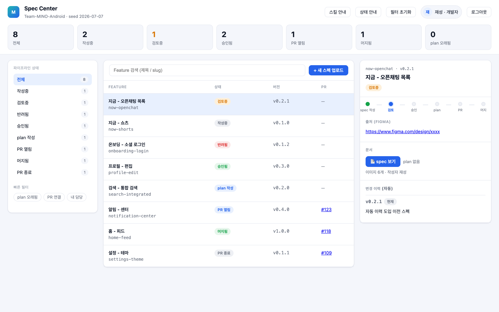
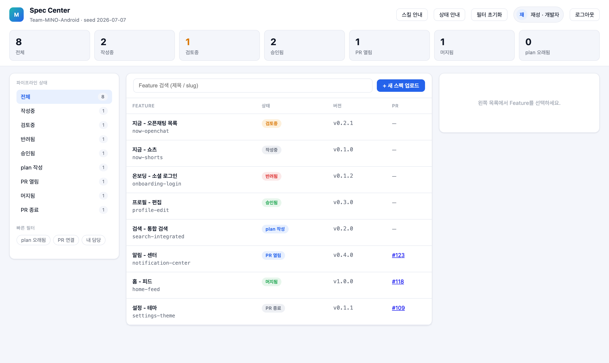
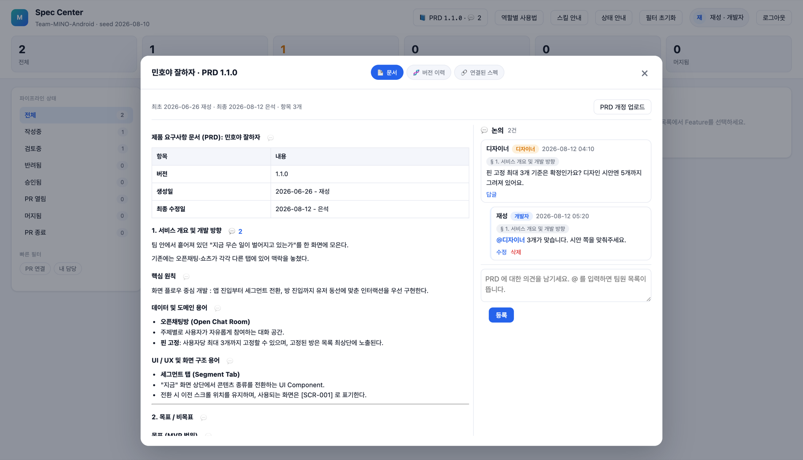
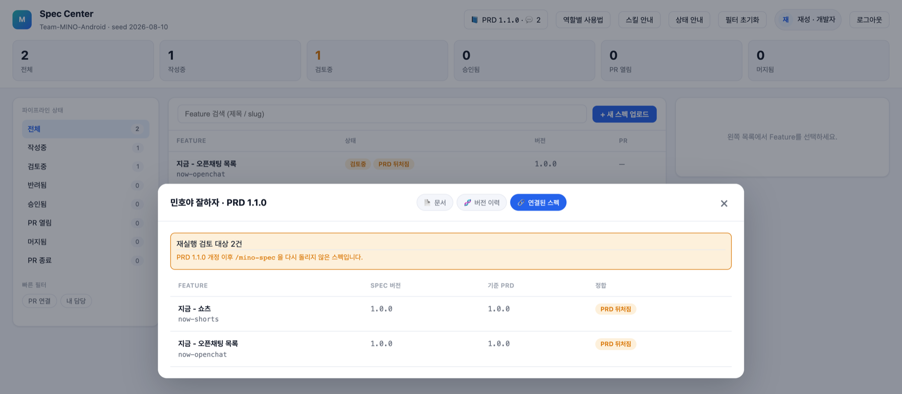
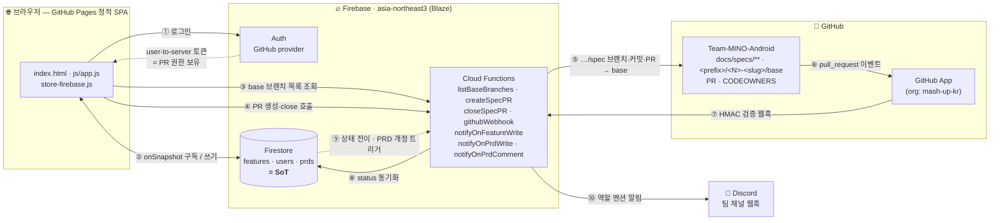

<div align="center">

# 🅼 MASC · Mino Android Spec Center

**디자이너 컨펌부터 문서 PR까지, 안드로이드 스펙 파이프라인을 한 화면에서.**

Team-MINO-Android의 기능 스펙(spec)을 업로드하고,
디자이너 컨펌 게이트를 거쳐 이슈 base 브랜치로 `docs/specs/**` spec PR을 자동 배출하는 대시보드입니다.

[](https://mash-up-kr.github.io/mino-android-spec-center/)
[](#-인프라-아키텍처)
[](LICENSE)



</div>

---

## MASC란?

기획·디자인은 Figma에, 스펙 문서는 여기저기 흩어지고, "이 화면 확정된 거 맞아요?"를 매번 물어보던 흐름을 하나의 파이프라인으로 묶습니다.

- **개발자**가 로컬 스킬(`/mino-spec`)로 만든 산출물 2개(`spec.md` + `quality/spec-checklist.md`)를 첨부하면,
- 대시보드가 **구조를 기계 검증**(spec S1–S6 · 체크리스트 C1–C7)하고,
- **디자이너가 유저 플로우 단위로 컨펌**(승인/반려+코멘트) — **검수 대상은 spec 하나**, 체크리스트는 읽기 전용 참고 자료,
- 승인된 스펙은 **두 문서가 함께 PR로 자동 생성**되며 — **base는 `develop`이 아니라 그 이슈의 `…/base` 브랜치**,
- PR이 머지/종료되면 **웹훅으로 상태가 되돌아오고**,
- 컨펌 요청·승인·반려·무효화·머지는 **Discord로 역할 멘션 알림**이 갑니다.

하나의 기능(`docs/specs/{feature}/`)은 **7개 상태를 가진 단일 파이프라인**으로 흐르고, Firestore가 유일한 진실(SoT)입니다.
그 위에는 프로젝트당 하나뿐인 상위 문서 **PRD**(`docs/prd/business-context.md`)가 있습니다 — 컨펌 게이트를 타지 않고, **팀 전원의 논의 공간 + spec과의 버전 정합 추적기**로만 동작합니다.

```
spec_draft → spec_in_review → spec_approved → pr_open → merged
                   ↓ 반려                          ↘ pr_closed
        spec_changes_requested
```

> 승인 후 spec을 수정하면 자동으로 **무효화**됩니다 — `spec_draft`로 복귀하고 열린 PR은 자동 close됩니다.
> 해제된 변경이 **디자인에 영향이 없으면**(예: PRD 개정 반영) 개발자가 **`⚡ 자체 승인`**(사유 필수)으로 컨펌 왕복 없이 되돌릴 수 있습니다 — 첫 승인은 반드시 디자이너가 하고, 반려된 스펙에는 쓸 수 없습니다.
> plan·task는 대시보드를 거치지 않습니다. spec PR이 base 브랜치에 머지된 뒤 같은 base 아래에서 `/mino-plan`·`/mino-task`로 이어집니다.

---

## ✨ 주요 기능

| | 기능 | 설명 |
|---|---|---|
| 📤 | **스펙 업로드 + 구조 검증** | `/mino-spec` 산출물 2개(`spec.md` + `quality/spec-checklist.md`)를 파일로 첨부(드롭 시 본문 H1으로 자동 분류). spec은 **S1–S6**, 체크리스트는 **C1–C7** 기계 검증 통과 시 생성. 상태 `DRAFT`·`[TBD]` 잔여·체크리스트 `FAILED`는 **차단하지 않고 경고** — 확정이 필요한 스펙일수록 검수에 올린다 ([validation.md](docs/design/validation.md)) |
| ✅ | **디자이너 컨펌 게이트** | 유저 플로우/요구사항 단위 **인라인 코멘트**로 승인·반려. 검토 중에는 spec read-only 잠금 |
| ⚡ | **자체 승인** | 디자인 영향이 없는 재업로드(PRD 개정 반영 등)는 개발자가 **사유를 남기고** 컨펌 없이 승인. 이미 디자이너 승인을 받은 스펙에서만 가능하고, 사유는 이력·PR 본문·Discord 알림에 남습니다 |
| 🔀 | **base 브랜치 타겟 spec PR** | 승인 시 `<prefix>/<이슈번호>-<slug>/spec` 브랜치를 **이슈 base 브랜치에서 분기**해 커밋·PR 생성. base 목록은 GitHub API로 조회해 업로드 시 선택 |
| 🔁 | **웹훅 상태 동기화** | PR merged/closed 이벤트를 HMAC 검증 후 수신 → Firestore 상태 자동 갱신 |
| 🧬 | **버전 스냅샷** | 버전 값은 `/mino-spec` 스킬이 소유(헤더 `**버전**`). 대시보드는 버전별 본문 스냅샷만 남기고 MAJOR/MINOR/PATCH는 semver 비교로 파생 표시 |
| 🧾 | **재검토 diff** | "지난 검토 이후 변경분"을 버전 스냅샷 기준으로 표시 |
| 🔔 | **Discord 알림** | 컨펌 요청·승인·반려·무효화·머지를 Firestore 트리거가 감지해 **역할 멘션**과 함께 Discord로 전송(spec 파이프라인은 Android·Design 태그). 알림 클릭 시 해당 feature로 딥링크 ([상황별 미리보기](https://mash-up-kr.github.io/mino-android-spec-center/docs/v2/notifications/preview.html)) |
| 📘 | **PRD 트랙 (상위 문서)** | `/mino-prd` 산출물(`docs/prd/business-context.md` · 프로젝트당 1개)을 업로드(**P1–P7** 검증 · 개발자 한정)해 팀 공용으로 두고, **전원이 섹션 앵커 댓글로 논의**(1단 답글 · 본인 수정/소프트 삭제 · `@` 자동완성 멘션). spec 헤더의 `**기준 PRD 버전**`으로 **버전 정합을 추적**(🔴비호환/🟡뒤처짐)하고, 임의 두 버전 **diff**(변경 섹션 요약)를 제공 ([설계](docs/design/prd-track.md)) |
| 📣 | **PRD 개정 방송** | 등록·MAJOR·MINOR 개정은 **Android·Design·iOS·Node 4개 역할 전부**에게 알립니다 — PRD는 제품 전체 문서라 플랫폼을 가리지 않습니다. **뒤처진 spec 목록을 동봉**하고, PATCH·본문 갱신은 무멘션. 댓글 알림은 **@멘션이 포함된 것만** ([상황별 미리보기](https://mash-up-kr.github.io/mino-android-spec-center/docs/v2/notifications/preview.html)) |
| 🔒 | **역할 기반 보안규칙** | Firestore 규칙이 역할별 전이 허용목록·필드 잠금·위조 차단을 강제. 민감 전이는 Functions 전용 |

<div align="center">

<br><em>7개 상태를 아우르는 파이프라인 대시보드</em>
</div>

<div align="center">

<br><em>PRD 뷰 — 왼쪽은 본문(섹션마다 💬 앵커), 오른쪽은 전원이 참여하는 논의 스레드</em>
</div>

<div align="center">

<br><em>「연결된 스펙」 — PRD가 개정되면 기준 버전이 뒤처진 spec이 여기와 목록 뱃지에 드러납니다</em>
</div>

---

## 🏗 인프라 아키텍처

정적 SPA(GitHub Pages) + Firebase(Auth/Firestore/Functions) + GitHub App으로 구성된 서버리스 파이프라인입니다.


```mermaid
flowchart LR
  subgraph Client["🌐 브라우저 — GitHub Pages 정적 SPA"]
    UI["index.html · js/app.js<br/>store-firebase.js"]
  end

  subgraph Firebase["🔥 Firebase · asia-northeast3 (Blaze)"]
    Auth["Auth<br/>GitHub provider"]
    FS[("Firestore<br/>features · users · prds<br/><b>= SoT</b>")]
    FN["Cloud Functions<br/>listBaseBranches · createSpecPR<br/>closeSpecPR · githubWebhook<br/>notifyOnFeatureWrite<br/>notifyOnPrdWrite · notifyOnPrdComment"]
  end

  subgraph GH["🐙 GitHub"]
    App["GitHub App<br/>(org: mash-up-kr)"]
    Repo["Team-MINO-Android<br/>docs/specs/** · &lt;prefix&gt;/&lt;N&gt;-&lt;slug&gt;/base<br/>PR · CODEOWNERS"]
  end

  DC["💬 Discord<br/>팀 채널 웹훅"]

  UI -->|① 로그인| Auth
  Auth -.->|user-to-server 토큰<br/>= PR 권한 보유| UI
  UI <-->|② onSnapshot 구독 / 쓰기| FS
  UI -->|③ base 브랜치 목록 조회| FN
  UI -->|④ PR 생성·close 호출| FN
  FN -->|⑤ …/spec 브랜치·커밋·PR → base| Repo
  Repo -->|⑥ pull_request 이벤트| App
  App -->|⑦ HMAC 검증 웹훅| FN
  FN -->|⑧ status 동기화| FS
  FS -.->|⑨ 상태 전이 · PRD 개정 트리거| FN
  FN -->|⑩ 역할 멘션 알림| DC
```

**핵심 설계**

- **SoT = Firestore.** 레포의 `docs/specs/**`·`docs/prd/**` 파일은 스냅샷이며 역수정하지 않습니다.
- **PRD는 PR을 만들지 않습니다.** PRD 파일의 커밋 경로는 `/mino-prd` + 평상시 PR로 이미 존재합니다. 대시보드가 두 번째 경로를 만들면 SoT가 갈리므로, PRD에서 대시보드의 역할은 *공유 아카이브 + 논의 + 호환 추적*으로 한정합니다.
- **base 브랜치는 추측하지 않습니다.** `/issue`가 만든 `<prefix>/<이슈번호>-<slug>/base`를 GitHub API로 조회해 업로드 시 개발자가 고릅니다 (Mino-Android `docs/conventions/base-branch.md`).
- **로그인 토큰이 곧 PR 권한.** Firebase Auth의 GitHub provider가 GitHub App client로 설정돼, 로그인 시 받는 user-to-server 토큰이 이미 PR-capable입니다. 별도 authorize 온보딩이 없습니다.
- **2단 방어선.** 역할·전이 적법성은 Firestore 보안규칙이 1차로, PR/웹훅 같은 민감 전이는 Cloud Functions(Admin SDK)가 2차로 강제 — 클라이언트는 상태를 위조할 수 없습니다.
- **정적 프론트.** 빌드 스텝 없는 vanilla JS. `store.js`(mock) ↔ `store-firebase.js`(실 백엔드)를 플래그로 전환하는 어댑터 구조라, 백엔드 없이도 로컬에서 동작합니다.

📋 **정본 요구사항은 [docs/PRD.md](docs/PRD.md)** — 아래 설계·운영 문서가 인용하는 원천입니다.

자세한 설계는 [docs/](docs/) 참고:
[상태머신](docs/design/state-machine.md) · [데이터 모델](docs/design/data-model.md) · [구조 검증](docs/design/validation.md) · [PRD 트랙](docs/design/prd-track.md) · [인프라 플레이북](docs/ops/infra-playbook.md) · [로드맵](docs/ops/roadmap.md)

---

## 👥 역할별 사용법

MASC는 **개발자**와 **디자이너** 두 역할로 나뉩니다. 각자의 화면·액션·주의사항을 별도 문서로 정리했습니다.

| 역할 | 하는 일 | 가이드 |
|---|---|---|
| 🧑‍💻 **개발자** | `/issue`로 base 브랜치 → `/mino-spec` 작성 → 업로드·검증 → 컨펌 요청 → 반려 반영 → PR 생성 → 무효화 관리. **PRD 업로드·개정도 개발자 담당** | 📖 **[docs/role/DEVELOPER.md](docs/role/DEVELOPER.md)** |
| 🎨 **디자이너** | 검토 중 스펙을 유저 플로우 단위로 확인(Figma 링크 대조) → 인라인 코멘트로 승인 / 반려 | 📖 **[docs/role/DESIGNER.md](docs/role/DESIGNER.md)** |

**PRD 논의는 역할을 가리지 않습니다** — 업로드만 개발자 한정이고, 읽기·섹션 앵커 댓글·`@`멘션은 로그인한 전원이 사용합니다.

---

## 🚀 로컬에서 실행

빌드가 없습니다. 정적 파일을 서빙하기만 하면 됩니다.

```bash
# 실 백엔드(Firebase) 연결 — js/firebase-config.js 의 enabled: true
python3 -m http.server 8000
# → http://localhost:8000
```

Firebase 없이 **mock 데이터로만** 띄우려면 `js/firebase-config.js`의 `enabled`를 `false`로 두면 `store.js`가 `data/seed.js`를 읽어 동작합니다(로그인·전이 모두 localStorage).

인프라를 처음부터 세팅하려면 → [docs/ops/infra-playbook.md](docs/ops/infra-playbook.md) (GitHub App → Firebase → Webhook → CODEOWNERS 순).

---

## 📁 프로젝트 구조

```
├─ index.html · styles.css      # 대시보드 셸 + 스타일
├─ js/
│   ├─ app.js                   # UI 렌더·이벤트 (데이터는 store 통해서만 접근)
│   ├─ store-firebase.js        # Firebase 어댑터 (실 백엔드)
│   ├─ store.js                 # mock 어댑터 (localStorage)
│   ├─ validate.js              # S1–S6 · C1–C7 · P1–P7 구조 검증
│   ├─ version.js               # 버전 스냅샷 · semver 비교 · diff · PRD 호환 등급
│   ├─ spec-parse.js            # spec 헤더 메타·섹션 파싱 (slug·title·버전·Figma)
│   └─ prd-parse.js             # PRD 파서 (표 헤더 · H1 섹션 · 주석 스트립)
├─ functions/
│   ├─ index.js                 # listBaseBranches · createSpecPR · closeSpecPR · githubWebhook
│   ├─ notify.js                # 상태 전이·PRD 개정·멘션 댓글 → Discord 역할 멘션 알림
│   ├─ semver.js                # 서버측 semver·PRD 호환 등급 (js/version.js 미러)
│   └─ token-store.js           # 사용자 GitHub 토큰 Secret Manager 저장/조회
├─ firestore.rules · storage.rules   # 역할·전이·필드 잠금
├─ data/seed.js                 # mock 시드
└─ docs/
    ├─ PRD.md                   # 정본 요구사항 (원천)
    ├─ design/                  # 설계 명세 — state-machine · data-model · validation · prd-track
    ├─ ops/                     # 운영 — infra-playbook · roadmap
    ├─ role/                    # 역할별 사용법 — DEVELOPER · DESIGNER
    ├─ v2/                      # 확장 설계 — notifications(구현됨) · impl-tracking · discussion(미착수)
    ├─ examples/                # 예시 spec
    └─ images/                  # README 캡쳐
```

---

<div align="center">
<sub>Team-MINO-Android · 민호야 잘하자 🤙</sub>
</div>
