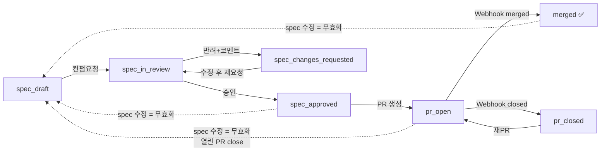
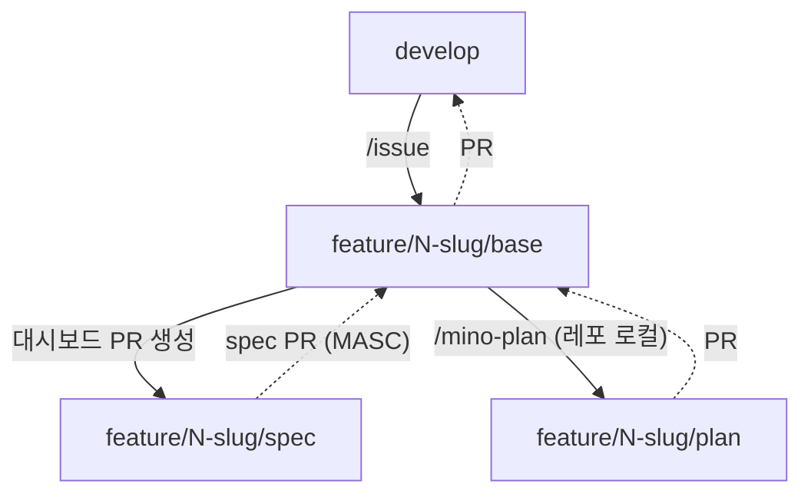

# 파이프라인 상태머신 (구현 명세)

> 출처: [PRD](../PRD.md) 4.5 · 4.8 · 6장 · 8장
> 상태: **구현 완료 (M0–M4 MVP, 실 백엔드 검증)** · v3 (plan 단계 제거 · base 브랜치 타겟) 기준
> 단위: `docs/specs/{feature}/` 한 묶음(`spec.md` + `quality/spec-checklist.md`)이 **단일 `status`** 를 가진다. 상태를 움직이는 건 spec 컨펌이고, 체크리스트는 같은 묶음에 실려 다닌다(검수 대상 아님).

문서 "진실"은 Firestore(`features/{id}`)다. 레포 파일은 스냅샷이며 역수정하지 않는다.

## 0. v3 변경 요약 (2026-08-10)

| 항목 | v2 | v3 |
|---|---|---|
| plan 검토 단계 | `spec_approved → plan_drafted → pr_open` | **`plan_drafted` 폐기** — `spec_approved → pr_open` |
| PR base 브랜치 | `develop` 고정 | 이슈별 `<prefix>/<이슈번호>-<slug>/base` |
| PR head 브랜치 | `docs/spec-{slug}-{version}` | `<prefix>/<이슈번호>-<slug>/spec` |
| 커밋 대상 | `spec.md` + `plan.md` + `assets/*` | **`spec.md` + `quality/spec-checklist.md`** (plan·assets 폐기) |
| 버전 소유권 | 대시보드가 bump | **로컬 `/mino-spec` 스킬**이 소유, 대시보드는 읽기만 |

plan/task 는 대시보드를 거치지 않고 같은 base 브랜치 아래 하위 작업 브랜치로 진행한다
(Mino-Android `docs/conventions/base-branch.md`). 디자이너 컨펌 게이트는 **spec 에만** 적용된다.

## 1. 상태(enum) — 7개

| status | 의미 | 편집 권한 | spec |
|---|---|---|---|
| `spec_draft` | spec 작성/수정 중 (초기 상태) | 개발자 | 편집가능 |
| `spec_in_review` | 디자이너 검토 중 | **read-only** | 잠금 |
| `spec_changes_requested` | 반려됨 | 개발자 | 편집가능 |
| `spec_approved` | spec 컨펌 완료 → PR 생성 잠금 해제 | (수정 시 무효화) | read-only* |
| `pr_open` | spec PR 열림 (base 브랜치 타겟) | — | — |
| `merged` | base 브랜치에 머지 완료 → plan/task 단계로 | — | — |
| `pr_closed` | PR 미머지 종료 | — | — |

\* `spec_approved` 이후 spec을 **어떤 수정이든** 하면 무효화 연쇄(§3) 발동.

## 2. 전이표 (trigger → guard → 결과)

| from | trigger | guard | to | 부수효과 |
|---|---|---|---|---|
| `spec_draft` | 컨펌요청 | 구조검증 통과(validation.md) · role=developer | `spec_in_review` | spec read-only 잠금 |
| `spec_changes_requested` | 컨펌요청(재요청) | 위와 동일 | `spec_in_review` | — |
| `spec_in_review` | 승인 | role=designer | `spec_approved` | `reviews[]` 기록 · PR 생성 잠금 해제 |
| `spec_in_review` | 반려+코멘트 | role=designer · 코멘트≥1 | `spec_changes_requested` | `reviews[]` 기록 |
| `spec_approved` | PR 생성 | role=developer · `baseBranch` 유효 · 로그인 토큰이 PR 권한 보유 | `pr_open` | `createSpecPR` 호출 · prNumber/prUrl 기록 |
| `pr_open` | Webhook: merged | HMAC 검증 | `merged` | — (버전 조작 없음) |
| `pr_open` | Webhook: closed(미머지) | HMAC 검증 | `pr_closed` | — |
| `pr_closed` | 재오픈/재PR | role=developer | `pr_open` | 새 PR 또는 재오픈 |

> **PR 권한 정정(2026-07-04)**: Firebase Auth GitHub provider가 GitHub App client로 설정돼 있어 **로그인 토큰이 이미 PR-capable**(user-to-server). 별도 `authorize`/`githubOAuthExchange` 온보딩은 폐기됐다 — 로그인=신원+PR권한 겸함.

### 무효화 전이 (어느 상태에서든)
| from | trigger | to | 부수효과 |
|---|---|---|---|
| `spec_approved` · `pr_open` · `merged` | spec 수정 | `spec_draft` | 열린 PR 자동 close(`closeSpecPR`) · 버전이 그대로면 `versionStale` 경고 |

## 3. 무효화 연쇄 (4.5 · 4.8 · M4)

> **UI 표기는 "승인 해제"** (2026-08-16). 설계·코드에서는 계속 *무효화 연쇄*로 부르지만, 사용자에게 보이는 문구(대시보드 alert·범례·가이드 · Discord 알림 · PR close 코멘트)는 **승인 해제**로 통일한다. "무효화"만 쓰면 무효가 된 대상이 *방금 올린 수정본*인지 *기존 승인*인지 모호해 업로드가 반려·무시된 것으로 읽혔다. 문구는 ① 저장 성공을 먼저 알리고 ② 해제된 대상이 승인임을 명시하고 ③ 다음 행동(재컨펌)을 준다.

`spec_approved`(또는 `pr_open`/`merged`) 이후 spec 본문을 수정하면:
1. `status → spec_draft` 복귀 (재컨펌 필수)
2. 열린 PR(`pr_open`)이 있으면 **자동 close**(`closeSpecPR`) + 무효화 코멘트
3. 새 본문이 `versionLog` 스냅샷에 반영 — 헤더 버전이 올라갔으면 새 항목 append, 그대로면 마지막 항목의 스냅샷만 갱신하고 **버전 미변경 경고**를 띄운다

> **버저닝 소유권(2026-08-10 개정)**: `specVersion`은 **로컬 `/mino-spec` 스킬**이 소유한다. 스킬이 개정 등급(MAJOR/MINOR/PATCH)을 사용자 승인 하에 판정해 spec.md 헤더 `**버전**`을 올리고, 대시보드는 업로드 시 그 값을 **읽기만** 한다. v2의 대시보드 자동 bump·`## 변경 이력` 표 주입·`v0.1.0` 강제·머지 시 승격은 모두 폐기됐다.
> 대시보드가 유지하는 것은 **버전별 본문 스냅샷**(`versionLog[].body`)뿐이며, 목적은 재검토 시 "지난 검토 이후 변경분" diff 를 만드는 것이다. MAJOR/MINOR/PATCH 뱃지는 직전 스냅샷과의 semver 비교로 표시 시점에 파생한다(`js/version.js` `levelBetween`).

> plan은 대시보드 컨펌 게이트가 **없다**(v3에서 `plan_drafted` 상태 자체를 제거). plan 검증은 base 브랜치 하위 PR 리뷰가 흡수한다. 디자이너는 spec에만 관여.

## 4. 다이어그램

## 5. 브랜치 흐름 (base-branch.md 연계)

- 대시보드가 만드는 것은 **`…/spec` 브랜치와 그 PR 뿐**이다. base 브랜치 자체는 `/issue`가, plan/task 하위 브랜치는 로컬 스킬이 만든다.
- 대시보드는 base 브랜치를 **추측하지 않는다** — 업로드 시 개발자가 GitHub API로 조회된 `…/base` 목록에서 고르고, 그 값이 `features.baseBranch`로 저장된다.

## 6. 마일스톤 매핑 (어느 전이가 어느 M에서 동작하는가)

| 전이 | M |
|---|---|
| `spec_draft` 생성 · 구조검증 | M1 |
| `→spec_in_review`/`→spec_approved`/`→spec_changes_requested` (컨펌 게이트) | M2 |
| `→pr_open` (createSpecPR) | M3 |
| `→merged`/`→pr_closed` (Webhook) · 무효화 연쇄 | M4 |

→ **7개 상태 전부 도달·전이 완결 = MVP 정의.**
