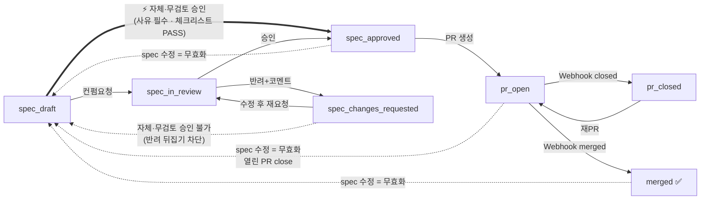
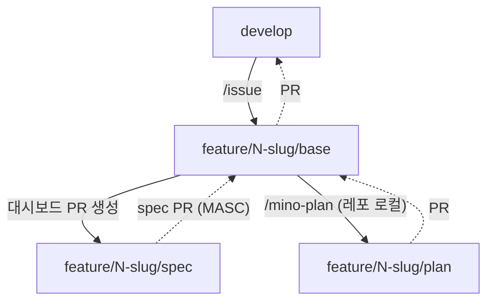

# 파이프라인 상태머신 (구현 명세)

> 출처: [PRD](../PRD.md) 4.5 · 4.8 · 6장 · 8장
> 상태: **구현 완료 (M0–M4 MVP, 실 백엔드 검증)** · v3 (plan 단계 제거 · base 브랜치 타겟) + **P9 자체 승인 · P9.1 무검토 승인**(2026-08-19) 기준
> 단위: `docs/specs/{feature}/` 한 묶음(`spec.md` + `quality/spec-checklist.md`)이 **단일 `status`** 를 가진다. 상태를 움직이는 건 spec 컨펌이고, 체크리스트는 같은 묶음에 실려 다닌다(검수 대상 아님).

문서 "진실"은 Firestore(`features/{id}`)다. 레포 파일은 스냅샷이며 역수정하지 않는다.

## 0. v3 변경 요약 (2026-08-10)

| 항목 | v2 | v3 |
|---|---|---|
| plan 검토 단계 | `spec_approved → plan_drafted → pr_open` | **`plan_drafted` 폐기** — `spec_approved → pr_open` |
| PR base 브랜치 | `develop` 고정 | 이슈별 `<prefix>/<이슈번호>-<slug>/base` |
| PR head 브랜치 | `docs/spec-{slug}-{version}` | `<prefix>/<이슈번호>-<slug>/spec` |
| 커밋 대상 | `spec.md` + `plan.md` + `assets/*` | **`spec.md` + `quality/spec-checklist.md`** (plan·assets 폐기) |
| 버전 소유권 | 대시보드가 bump | **로컬 `/mino-spec` 스킬**이 소유, 대시보드는 읽기만 |

plan/task 는 대시보드를 거치지 않고 같은 base 브랜치 아래 하위 작업 브랜치로 진행한다
(Mino-Android `docs/conventions/base-branch.md`). 디자이너 컨펌 게이트는 **spec 에만** 적용된다.

## 1. 상태(enum) — 7개

| status | 의미 | 편집 권한 | spec |
|---|---|---|---|
| `spec_draft` | spec 작성/수정 중 (초기 상태) | 개발자 | 편집가능 |
| `spec_in_review` | 디자이너 검토 중 | **read-only** | 잠금 |
| `spec_changes_requested` | 반려됨 | 개발자 | 편집가능 |
| `spec_approved` | spec 컨펌 완료 → PR 생성 잠금 해제. **도달 경로 3개**(디자이너 컨펌 · 개발자 유지 승인 · 개발자 무검토 승인 §2.1) | (수정 시 무효화) | read-only* |
| `pr_open` | spec PR 열림 (base 브랜치 타겟) | — | — |
| `merged` | base 브랜치에 머지 완료 → plan/task 단계로 | — | — |
| `pr_closed` | PR 미머지 종료 | — | — |

\* `spec_approved` 이후 spec을 **어떤 수정이든** 하면 무효화 연쇄(§3) 발동.

## 2. 전이표 (trigger → guard → 결과)

| from | trigger | guard | to | 부수효과 |
|---|---|---|---|---|
| `spec_draft` | 컨펌요청 | 구조검증 통과(validation.md) · role=developer | `spec_in_review` | spec read-only 잠금 |
| `spec_draft` | **자체·무검토 승인** | role=developer · **사유 ≥1자** · `checklistStatus == 'PASS'` · (디자이너 승인 이력이 없으면) `[TBD]` 0건 | `spec_approved` | `reviews[]` 에 `decision='self_approved'` + 사유 기록 · PR 생성 잠금 해제 · Discord 알림(**Design** 태그) |
| `spec_changes_requested` | 컨펌요청(재요청) | 위와 동일 | `spec_in_review` | — |
| `spec_in_review` | 승인 | role=designer | `spec_approved` | `reviews[]` 기록 · PR 생성 잠금 해제 |
| `spec_in_review` | 반려+코멘트 | role=designer · 코멘트≥1 | `spec_changes_requested` | `reviews[]` 기록 |
| `spec_approved` | PR 생성 | role=developer · `baseBranch` 유효 · 로그인 토큰이 PR 권한 보유 | `pr_open` | `createSpecPR` 호출 · prNumber/prUrl 기록 |
| `pr_open` | Webhook: merged | HMAC 검증 | `merged` | — (버전 조작 없음) |
| `pr_open` | Webhook: closed(미머지) | HMAC 검증 | `pr_closed` | — |
| `pr_closed` | 재오픈/재PR | role=developer | `pr_open` | 새 PR 또는 재오픈 |

> **PR 권한 정정(2026-07-04)**: Firebase Auth GitHub provider가 GitHub App client로 설정돼 있어 **로그인 토큰이 이미 PR-capable**(user-to-server). 별도 `authorize`/`githubOAuthExchange` 온보딩은 폐기됐다 — 로그인=신원+PR권한 겸함.

### 2.1 자체 승인 · 무검토 승인 (P9 · P9.1 · 2026-08-19)

**하나의 전이가 두 시나리오를 덮는다.**

| | ① 유지 승인 (P9) | ② 무검토 승인 (P9.1) |
|---|---|---|
| 상황 | PRD 개정 반영처럼 **디자인 영향이 없는 재업로드**로 승인이 해제됐다 | 화면이 없는 **기능 스펙** — 처음부터 디자이너가 볼 것이 없다 |
| 도입 배경 | 영향이 없는데도 매번 디자이너 검수를 다시 요청하는 왕복이 피로 요인 | 단순 기능 스펙까지 컨펌 게이트를 태우면 업로드→PR 이 하루 이상 늦어진다 |
| 디자이너 승인 이력 | **있다** (그 스펙의 유지 승인) | **없다** (게이트를 한 번도 통과하지 않음) |
| 버튼 라벨 | `⚡ 자체 승인` | `⚡ 무검토 승인` |

from/to·주체·기록 방식이 같으므로 **전이는 하나**다. 구분은 `reviews[]` 에서 파생한다 —
그 `self_approved` 항목보다 **앞에 디자이너 `approved` 가 있었는가**. P9.1 이 실제로 바꾼 것은
"디자이너 승인 이력 필수" 가드 **하나를 뺀 것**이고, 그 자리를 아래 보상 통제가 채운다.

**상태도 `decision` 도 늘리지 않는다.** 전용 상태를 만들면 스테퍼·필터·보안규칙·알림·`createSpecPR`
가드까지 전부 갈라지는데 얻는 건 표기 하나뿐이다. 같은 이유로 `decision='no_review_approved'` 같은
값도 만들지 않는다 — 파생 가능한 것을 저장하면 두 소스가 어긋난다.

| 가드 | 이유 | 강제 위치 |
|---|---|---|
| **`spec_draft` 에서만** | `spec_changes_requested` 에서 열어주면 개발자가 디자이너의 **반려를 뒤집을** 수 있다. 목표 시나리오 둘 다 `spec_draft` 를 거치므로 손해가 없다 | rules `devTransitionOk` + client |
| **사유 필수** | 컨펌을 건너뛴 이유가 남지 않으면 나중에 아무도 판단 근거를 모른다. `reviews[]` → 상세 이력 · PR 본문 · Discord 알림 세 곳으로 따라간다 | client (rules 는 `reviews` **+1 append** 만 강제 — 사유 없는 맨 상태 플립 차단) |
| **`checklistStatus == 'PASS'`** | 디자이너 검토를 생략하려면 **개발자 자가검증은 통과**해 있어야 한다. P9 의 "첫 승인은 디자이너" 가드를 대체하는 축 | **rules + client** (스칼라 필드라 서버에서 검사 가능) |
| **`[TBD]` 0건** (승인 이력 없을 때만) | `[TBD]` 는 [validation.md](validation.md) 가 정의한 *"디자이너와 확정해야 할 지점"* 표식이다. 그걸 남긴 채 "검토 불필요"를 주장하는 건 모순. 이미 승인된 스펙의 유지 승인에는 걸지 않는다 | client (본문 순회는 rules 에서 불가) |

> 가드에 걸릴 때 버튼을 **숨기지 않는다** — 비활성 + 툴팁에 이유를 남긴다. 사라지면 개발자는
> 왜 못 하는지 모른 채 컨펌 요청만 하게 되고, 그건 P9 가 없애려던 왕복 그대로다.

**승인 경로가 갈라져 보이는 4지점** — 상태가 같으므로 이 넷이 유일한 구분 표면이다.

| 지점 | 디자이너 컨펌 | 유지 승인 | 무검토 승인 |
|---|---|---|---|
| `reviews[]` | `decision:'approved'` | `self_approved` + 사유 (**앞에** `approved` 있음) | `self_approved` + 사유 (**앞에** `approved` 없음) |
| 배지 · 이력 태그 | 없음 | `자체 승인` (amber) | **`무검토 승인` (red)** |
| Discord ([notify.js](../../functions/notify.js)) | `✅ 승인됨` · Android | `⚡ 자체 승인` · Design + 사유 | `⚡ 무검토 승인` · Design + 사유 + "검토 이력 없음" |
| spec PR 본문 ([functions/index.js](../../functions/index.js) `approvalLine`) | `- [x] spec 컨펌됨` | `- [ ] … **개발자 자체 승인** · 사유: …` | `- [ ] spec 컨펌 **없음** — **개발자 무검토 승인**(디자이너 검토 이력 없음) · 사유: …` |
| 스테퍼 | `검토` = done | `검토` = done (과거 이력 실재) | **`검토` = skipped** (점선·취소선) |

무검토 승인 건에서 `검토`를 done(초록)으로 칠하면 디자이너가 본 것처럼 읽힌다 — 거치지 않은
단계는 거치지 않은 것으로 그린다(`js/app.js` `stepperHtml`).

### 2.2 디자인 스펙 / 기능 스펙 (P9.1)

무검토 승인의 대상을 목록에서 골라내는 축이 필요한데, **새 필드를 만들지 않는다** —
`figmaSources` 유무로 파생한다(`js/app.js` `specKind`).

| 파생값 | 조건 | 표시 |
|---|---|---|
| 디자인 스펙 | `figmaSources.length > 0` | 상세 배지 `디자인 스펙`(blue) |
| 기능 스펙 | `figmaSources.length === 0` | 상세 배지 `기능 스펙`(gray) |

**표시는 목록 위 탭**(`전체` / `디자인 스펙` / `기능 스펙`)이다 — 모든 스펙이 정확히 하나에 속하는
**배타 축**이라 가산 토글인 퀵필터 칩이 아니라 탭이 맞다. 탭 카운트는 *탭만 제외한 나머지 필터*
(상태·검색·퀵필터) 기준이라 "누르면 나올 건수"와 일치한다(`withoutKind()`). 상태 필터와는 AND 로 합성된다.
목록 행에는 종류 배지를 달지 않는다 — 탭이 문맥을 주고, 상태 셀에는 이미 상태·PRD 조치·승인 배지가 붙는다.

spec 본문의 `**Figma**:` 줄이 곧 "디자이너가 볼 것이 있다"는 신호이므로, 화면 근거가 없는 spec
= 컨펌 게이트를 태울 대상이 아니다. `reviewPolicy` 같은 전용 필드를 두면 rules 잠금·승인 해제
연쇄·업로드 UI 가 전부 그 필드를 알아야 하고, 판단 시점도 업로드로 앞당겨진다(정작 판단은 승인
시점에 한다). 파생값이라 **오분류 가능성**은 남는다(Figma 링크를 빠뜨린 디자인 스펙) — 그래서
필터는 표시 전용이고, Figma 근거가 있는 스펙을 무검토 승인하려 하면 **한 번 더 확인**을 받는다.

> **승인 철회는 두지 않았다**(2026-08-19 결정). 디자이너가 자체·무검토 승인에 이견이 있으면 Discord 알림을 보고
> 개발자에게 재컨펌을 요청하는 경로로 처리한다. 상태머신에 `spec_approved → spec_in_review`(디자이너) 전이는 **없다**.

### 무효화 전이 (어느 상태에서든)
| from | trigger | to | 부수효과 |
|---|---|---|---|
| `spec_approved` · `pr_open` · `merged` | spec 수정 | `spec_draft` | 열린 PR 자동 close(`closeSpecPR`) · 버전이 그대로면 `versionStale` 경고 |

## 3. 무효화 연쇄 (4.5 · 4.8 · M4)

> **UI 표기는 "승인 해제"** (2026-08-16). 설계·코드에서는 계속 *무효화 연쇄*로 부르지만, 사용자에게 보이는 문구(대시보드 alert·범례·가이드 · Discord 알림 · PR close 코멘트)는 **승인 해제**로 통일한다. "무효화"만 쓰면 무효가 된 대상이 *방금 올린 수정본*인지 *기존 승인*인지 모호해 업로드가 반려·무시된 것으로 읽혔다. 문구는 ① 저장 성공을 먼저 알리고 ② 해제된 대상이 승인임을 명시하고 ③ 다음 행동(재컨펌)을 준다.

`spec_approved`(또는 `pr_open`/`merged`) 이후 spec 본문을 수정하면:
1. `status → spec_draft` 복귀 (재컨펌 필수)
2. 열린 PR(`pr_open`)이 있으면 **자동 close**(`closeSpecPR`) + 무효화 코멘트
3. 새 본문이 `versionLog` 스냅샷에 반영 — 헤더 버전이 올라갔으면 새 항목 append, 그대로면 마지막 항목의 스냅샷만 갱신하고 **버전 미변경 경고**를 띄운다

> **버저닝 소유권(2026-08-10 개정)**: `specVersion`은 **로컬 `/mino-spec` 스킬**이 소유한다. 스킬이 개정 등급(MAJOR/MINOR/PATCH)을 사용자 승인 하에 판정해 spec.md 헤더 `**버전**`을 올리고, 대시보드는 업로드 시 그 값을 **읽기만** 한다. v2의 대시보드 자동 bump·`## 변경 이력` 표 주입·`v0.1.0` 강제·머지 시 승격은 모두 폐기됐다.
> 대시보드가 유지하는 것은 **버전별 본문 스냅샷**(`versionLog[].body`)뿐이며, 목적은 재검토 시 "지난 검토 이후 변경분" diff 를 만드는 것이다. MAJOR/MINOR/PATCH 뱃지는 직전 스냅샷과의 semver 비교로 표시 시점에 파생한다(`js/version.js` `levelBetween`).

> plan은 대시보드 컨펌 게이트가 **없다**(v3에서 `plan_drafted` 상태 자체를 제거). plan 검증은 base 브랜치 하위 PR 리뷰가 흡수한다. 디자이너는 spec에만 관여.

## 4. 다이어그램

## 5. 브랜치 흐름 (base-branch.md 연계)

- 대시보드가 만드는 것은 **`…/spec` 브랜치와 그 PR 뿐**이다. base 브랜치 자체는 `/issue`가, plan/task 하위 브랜치는 로컬 스킬이 만든다.
- 대시보드는 base 브랜치를 **추측하지 않는다** — 업로드 시 개발자가 GitHub API로 조회된 `…/base` 목록에서 고르고, 그 값이 `features.baseBranch`로 저장된다.

## 6. 마일스톤 매핑 (어느 전이가 어느 M에서 동작하는가)

| 전이 | M |
|---|---|
| `spec_draft` 생성 · 구조검증 | M1 |
| `→spec_in_review`/`→spec_approved`/`→spec_changes_requested` (컨펌 게이트) | M2 |
| `spec_draft →spec_approved` (유지 승인 §2.1①) | P9 |
| `spec_draft →spec_approved` (무검토 승인 §2.1② · 승인 이력 없이) | P9.1 |
| `→pr_open` (createSpecPR) | M3 |
| `→merged`/`→pr_closed` (Webhook) · 무효화 연쇄 | M4 |

→ **7개 상태 전부 도달·전이 완결 = MVP 정의.**
