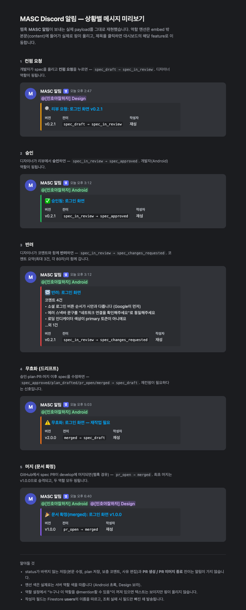

# 알림 (Notifications) — P5.2 확장 설계

> 기존 파이프라인(M0–M4) + P3 보안규칙 위에 얹는 **협업 확장 C3**.
> 상태 전이·리뷰 결정·새 논의를 **Discord로 알림**해, 팀이 대시보드를 상주하지 않아도 흐름이 돌게 한다.
> 짝 문서: [discussion.md](../discussion.md) — 알림이 감지하는 `discussion` 서브컬렉션·활동은 그쪽에서 만든다. **P5.1(discussion) 선행 권장.**
> 설계 기반: [state-machine.md](../../design/state-machine.md) · [functions/index.js](../../../functions/index.js) · [infra-playbook.md](../../ops/infra-playbook.md)
> 상태(2026-07-08): **1차 구현·배포·실알림 검증 완료.** P5.1 없이 가능한 범위(상태전이+리뷰 알림, 역할 실멘션, 딥링크)를 구현 — `functions/notify.js`(asia-northeast3). discussion 알림·"내 멘션"칩은 P5.1 후속.
> **구현 노트:** 현 구조에서 리뷰는 `features/{id}.reviews[]` 배열이고 승인/반려가 status 변경과 **같은 쓰기**로 온다 → §3의 review 트리거를 분리하지 않고 `onDocumentWritten('features/{id}')` 하나가 상태전이+리뷰를 중복 없이 커버한다. P5.1에서 서브컬렉션 전환 시 §3 원안(트리거 분리)으로 이행.

범례: `[ ]` 미착수 · `[~]` 진행중 · `[x]` 완료 · `(ops)` 운영작업 · `(BE)` Cloud Functions · `(FE)` 프론트

**확정 결정(2026-07-07 논의):** 알림 채널 = **Discord 웹훅** (Slack/이메일/인앱 미채택).

---

## 1. 배경 — 상태가 바뀌어도 아무도 모른다

현재 아웃바운드는 GitHub API(PR 생성)뿐이고 알림 인프라가 없다. 그래서:

- 디자이너는 컨펌 요청이 온 걸 **대시보드를 열어봐야** 안다.
- 개발자는 자기 spec이 승인/반려된 걸, 무효화(드리프트)가 생긴 걸 모른 채 지나갈 수 있다.
- [discussion.md](../discussion.md)에서 새로 생기는 논의·@멘션도 도달 수단이 없으면 반쪽짜리다.

```
목표:  상태 전이 · 리뷰 결정 · 새 논의  ──Firestore 트리거──▶  Discord 채널
```

C3는 **도달(reach)** 을 연다. C1(논의)과 붙어야 "팀이 상주하지 않아도 반응하는" 협업 루프가 완성된다.

## 2. 목표 / 비목표

**목표**
- 컨펌 요청·승인·반려·무효화·머지 등 **상태 전이를 Discord로 알림**.
- [discussion.md](../discussion.md)의 **새 논의·@멘션을 대상자에게 알림**.
- 신규 수신 인프라 0 — 아웃바운드 웹훅 하나만 추가.

**비목표 (이번 범위 아님 · §7 보류)**
- 개인 DM/실제 Discord `<@id>` 멘션(Discord user id 매핑 필요) — MVP는 **공용 채널 + 역할 타겟 문구**. (Tier 2)
- 인앱 알림센터(읽음상태 추적) — Discord로 충분, 후속 선택.
- 이메일/Slack 등 타 채널.
- 알림 취향/음소거 — 노이즈가 문제될 때 후속.

## 3. 발동은 서버측 트리거로

클라 호출 방식은 우회 가능 + **웹훅발 전이(merged)** 를 놓친다([githubWebhook](../../../functions/index.js)가 클라를 안 거치고 상태를 바꿈). 그래서 Firestore 트리거로 상태·문서 생성을 서버에서 감지한다.

| 트리거 (functions v2) | 감지 | 알림 |
|---|---|---|
| `onDocumentWritten('features/{id}')` | `before.status != after.status` | 아래 전이표 |
| `onDocumentCreated('features/{id}/reviews/{r}')` | 새 게이트 결정 | 승인 / 반려(코멘트 요약 포함) |
| `onDocumentCreated('features/{id}/discussion/{m}')` | 새 논의 | 멘션 대상 + (작성자≠spec작성자면) spec 작성자 |

**전이 → 알림 매핑** (중복 방지를 위해 리뷰 결정은 리뷰 트리거, 순수 상태 변화는 feature 트리거가 담당):

| 이벤트 | 소스 | 대상 | 문구 예 |
|---|---|---|---|
| 컨펌 요청 (`→ spec_in_review`) | feature | 디자이너 | "🔍 리뷰 요청: {title} v{ver}" |
| 승인 (`approved`) | review | spec 작성자 | "✅ 승인됨: {title}" |
| 반려 (`changes_requested`) | review | spec 작성자 | "🔁 반려: {title} — {코멘트 n건 요약}" |
| 무효화/드리프트 (`→ spec_draft` from committed) | feature | spec 작성자 | "⚠️ 무효화: {title} — 재작업 필요" |
| 머지 (`→ merged`) | feature | 작성자·관련자 | "🎉 문서 확정(merged): {title} v1.0.0" |
| 새 논의·멘션 | discussion | 멘션·작성자 | "💬 {author}: {본문 앞부분}" |

- **가드:** 트리거는 모든 쓰기에 발화 → `before.status === after.status` 이고 관심 필드가 안 바뀌었으면 조용히 종료(노이즈 차단). 논의 알림은 MVP에서 **멘션 + spec 작성자**로 한정(전체 브로드캐스트는 노이즈).
- **중복 방지:** 승인/반려는 review 트리거만, 순수 상태 변화(컨펌요청·무효화·머지)는 feature 트리거만 — 겹치지 않게 분담. `requestReview`는 review 문서 없이 status만 바꾸므로 feature 트리거가 담당.

## 4. Discord 페이로드

- **Incoming Webhook**(채널 1개)으로 `embeds` POST. 제목 = feature 제목 + 상태 뱃지 색, 설명 = 문구, 필드 = 버전·담당·링크.
- **딥링크:** 대시보드에 `?feature={id}` 진입 파라미터(소규모 FE 추가)를 붙여 알림에서 해당 feature로 바로 이동. 없으면 대시보드 루트로 폴백.
- **대상 표현(2026-07-08 격상):** 공용 채널 + **역할 실멘션** `<@&roleId>` — 컨펌요청=Design 역할, 승인/반려/무효화=Android 역할, 머지=둘 다. 멘션은 embed 안에서는 핑이 안 울리므로 **content 필드**에 넣고 `allowed_mentions.roles`로 한정. 역할 설정 "누구나 @mention 허용" 필요. 개인 `<@id>` 멘션(작성자 본인 핑)은 `users.discordId` 매핑 후 Tier 2 유지.

## 4b. 상황별 알림 UI 미리보기

5가지 상황이 Discord에서 실제로 렌더링되는 모습 (실 payload 재현 — 라이브 페이지: [preview.html](https://mash-up-kr.github.io/mino-android-spec-center/docs/v2/notifications/preview.html)):



## 5. 시크릿 / 인프라

- `DISCORD_WEBHOOK_URL` → Secret Manager(기존 `GITHUB_*` 시크릿과 동일 패턴, [infra-playbook](../../ops/infra-playbook.md)).
- 트리거 함수는 **Firestore 이벤트**라 HTTP 엔드포인트·CORS 불필요. 인바운드 웹훅 인프라와 무관.
- 아웃바운드 1개(Discord)만 추가 — 신규 수신 인프라 0.
- 크로스레포(Team-MINO-Android) 의존 **없음** — 전부 MASC 내부. `(ops)` Discord 서버에 Incoming Webhook 생성해 URL 확보하는 운영작업만.

## 6. 단계별 체크리스트 (P5.2)

> 선행: discussion 알림·"내 멘션"만 [discussion.md](../discussion.md) P5.1 필요. 상태전이+리뷰 알림은 현 구조로 선행 구현(2026-07-08, 위 구현 노트).

- [x] `(ops)` Discord Incoming Webhook 생성 → `DISCORD_WEBHOOK_URL` Secret Manager 등록 → `firebase deploy --only functions` → **실알림 검증 완료(2026-07-08)**
- [x] `(BE)` 역할 실멘션 — Android/Design 역할 `<@&roleId>`를 content 필드에(§4), MVP 텍스트 문구에서 격상(2026-07-08)
- [x] `(BE)` `onDocumentWritten('features/{id}')` — 상태 전이 → 알림(컨펌요청·무효화·머지) + 가드 — `functions/notify.js`
- [x] `(BE)` 승인/반려 알림(코멘트 요약) — 서브컬렉션 트리거 대신 위 feature 트리거가 `reviews[]` 배열 diff 로 처리(P5.1 전환 시 `onDocumentCreated('features/{id}/reviews/{r}')` 분리)
- [ ] `(BE)` `onDocumentCreated('features/{id}/discussion/{m}')` — 멘션·작성자 대상 알림 — **P5.1 후**
- [x] `(BE)` Discord embed 빌더 + 상태별 색/문구 + 딥링크 — `functions/notify.js`
- [x] `(FE)` `?feature={id}` 딥링크 진입 처리 — `js/app.js` (데이터 로드 후 1회 적용)
- [ ] `(FE)` KPI/필터칩 "내 멘션"(멘션 대기 뷰) — **P5.1 후**

## 7. 보류 / 후속

- **개인 DM/실제 Discord 멘션** — `users.discordId` 매핑 후 실제 `<@id>`. MVP는 공용 채널 + 텍스트. 온보딩에 `discordId` 입력 필드 또는 수동 매핑.
- **인앱 알림센터(읽음상태)** — Discord로 충분하면 불필요.
- **알림 취향/음소거** — 이벤트별·사용자별 on/off. 노이즈가 문제될 때.

## 8. 의사결정 로그

- **알림 채널 = Discord 웹훅** (Slack/이메일/인앱 미채택) — 팀 상주 채널, 시크릿 1개·함수로 최저 비용.
- **발동 = Firestore 트리거(서버)** — 클라 호출·웹훅 누락 회피. 상태·리뷰·논의 3개 트리거로 분담(중복 방지).
- **대상 = 공용 채널 + 역할 텍스트(MVP)** — 개인 멘션은 discordId 매핑 후 Tier 2.
- **논의 스레드는 별도 문서** — [discussion.md](../discussion.md)로 분리(2026-07-07).
